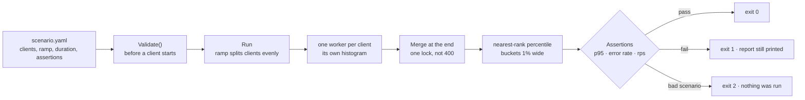

# go-loadtest-swarm

A load test for game backends that can fail a build: a YAML scenario, a latency histogram accurate to
1%, a report that goes into a pull request, and an exit code.

```bash
go run ./cmd/loadtest -scenario examples/events-ingest.yaml
# exit 0  every assertion held
# exit 1  the run finished and one of them did not
# exit 2  the run could not be made
```

A load test whose result nobody can fail is a demonstration. This one is written so that the number it
prints is the number that decides whether the branch merges.

## What a run looks like

Against a local server, four clients for three seconds - the server is `cmd/smoke-server`, and the
scenario allows a 1% error rate because even a local socket drops the odd connection:

```
### load test: local smoke

| requests | failures | rejected (4xx) | requests/s | clients | duration |
|---|---|---|---|---|---|
| 5653 | 3 | 0 | 1884.2 | 4 | 3s |

### latency (histogram, within 1%)

| p50 | p90 | p95 | p99 | p99.9 | max |
|---|---|---|---|---|---|
| 2ms | 3ms | 3ms | 5ms | 8ms | 11ms |

### status codes

| code | count |
|---|---|
| 200 | 5650 |

every assertion held: 5653 requests, p95 3ms, 1884.2 requests/s
```

The same command with twenty clients against the same server - Python's single-threaded `http.server` -
refuses twenty of the six thousand requests it is sent and answers the rest in 3ms:

```
$ go run ./cmd/loadtest -scenario smoke.yaml -clients 20
| requests | failures | rejected (4xx) | requests/s | clients | duration |
| 6359 | 20 | 0 | 2119.3 | 20 | 3s |
| p50 | p90 | p95 | p99 | p99.9 | max |
| 3ms | 5ms | 6ms | 9ms | 1.049s | 1.258s |

### the run did not hold to its assertions
- 20 requests failed and the scenario allows none
```

That is the tool doing its job: a p50 of 3ms next to a max of 1.2 seconds is a server that is fine until
it is not, and the mean of those two numbers is the one you would have put in a slide.

## The scenario is a file, because the claim is

```yaml
name: events ingest
target:
  url: http://localhost:8080/v1/events
  method: post
  headers:
    content-type: application/json
  body: '{"events":[{"user":"player-1","kind":"level_up","value":12}]}'
  timeout: 5s
load:
  clients: 50      # requests in flight at once: the unit a game server's capacity is wanted in
  duration: 30s    # long enough that a p99 means something
  ramp: 5s         # so that fifty clients do not arrive in the same millisecond
  think: 100ms     # what makes a simulated player behave like one
assert:
  p95: 50ms
  p99: 150ms
  max_error_rate: 0.01
  min_rps: 400
```

A misspelled key is an error rather than a scenario that quietly tests something else - `clints: 50`
would otherwise have run one client and reported a healthy server.

## The histogram

The number an operator acts on is a tail one: a mean latency of 40ms is what a player feels as a stutter
once a minute, and averaging is how that stutter disappears from the report. Keeping every sample is
either a memory leak or a lost tail, so a value goes into the bucket for the next 1% above it:

- any percentile is within 0.5% of the sample it came from,
- however long the run is, the memory is a few thousand counters,
- `Percentile` is nearest-rank: the p95 of a hundred samples is the ninety-fifth of them, not an
  interpolation between two that no player felt.

Each client keeps its own histogram and they are merged at the end, because one lock shared by four
hundred clients is a load test measuring its own contention.

## What the assertions mean

| Assertion | What it says |
|---|---|
| `p95`, `p99` | the latency that 95% and 99% of requests came in under |
| `max_latency` | the slowest single request, which no percentile shows |
| `max_error_rate` | the share of requests the server failed to answer |
| `min_rps` | the throughput floor, for a capacity test |

A `5xx` or a connection that never arrived counts as a failure. A `4xx` does not: a scenario that gets
400s is usually loading a URL that does not exist or is missing a token, so it is counted as *rejected*
and the report says so, rather than sending the reader looking for a server bug that is not there.

`-json` prints the same numbers for a CI job to chart over time, which is the only way a latency
regression is visible before a player reports it.

## Verified, not asserted

```bash
make test      # go test -race ./..., 89.9% of statements
make smoke     # builds the CLI and runs a real scenario against a local server, expects exit 0
```

There is no server in the tests: the engine takes a `Doer` and a clock, so a run of a thousand requests
takes milliseconds and the p50 is a fact rather than a hope - and the suite is run both with `-race` and
without, because a clock a test hands in pairs its readings in a different order under each. That is how
a p50 of 988ms in a test that says every request took 10ms was found: `go test -race ./...` passed and
the plain `go test .` that CI ran did not.

## What this is not

Not a driver for every protocol yet: the engine takes an HTTP client, and a WebSocket or UDP driver
plugs into the same `Doer` seam without the reporting changing. Not a distributed load generator either -
one process, which is what one machine can open, and the report says how many clients it was.

## License

MIT. See `LICENSE`, and `PROVENANCE.md` for where this code comes from.

## The pipeline as a picture




`docs/diagrams/assertion-pipeline.html` draws what the sample output above only shows the end of: the
scenario that decides what "good" means, the ramp that spreads clients over it, one worker per client with
its own histogram, the merge at the end, and the nearest-rank percentiles that the assertions — and
therefore the exit code — are computed from.

It also carries the two rows that make the point better than prose: 5,653 requests at p50 2 ms against the
Go smoke server, and the same harness against `python3 -m http.server` reading p99.9 1.05 s and exiting 1.
The second row is why the exit code exists.

`docs/diagrams/assertion-pipeline.mmd` is the Mermaid version; `make diagram` exports a PNG if a browser is
present, because the source is what gets reviewed.
